# Item Rumble Mod

## Features
Welcome to the Item Rumble Mod  where you can collect items on the notes you sing, each with unique effects like speeding up, slowing down, adding points, deducting points, muting audio, and hiding lyrics and notes. This mode will add a fun and competitive element to MelodyMania, making it more enjoyable for players who want a more dynamic experience.


### Balanced Challenge for All Skill Levels
In this mod, we've introduced dynamic item spawning based on your score distance from the leader. It's designed to ensure a fun experience for everyone, especially less experienced singers. Enjoy a game that adapts to your performance, making it engaging for all players.

## Already Implemented Items:
| Item Name | Description | Image |
| --- | --- | --- |
| Coin | Adds 100 Points |  |
| Banana | Subtracts 75 Points |   |
| Blue Shelli | Deducts 250 Points from the player in first place | 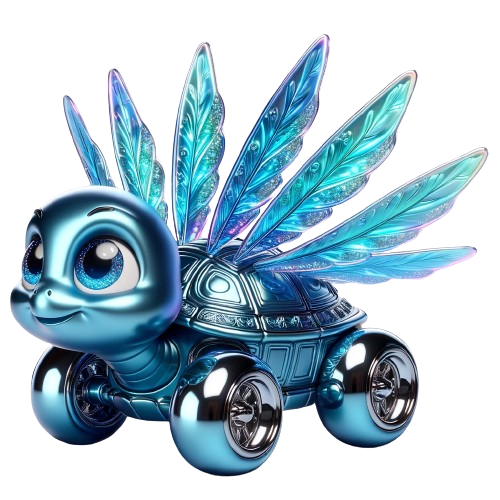 |
| Green Shelli | Deducts 50 points from a random player | 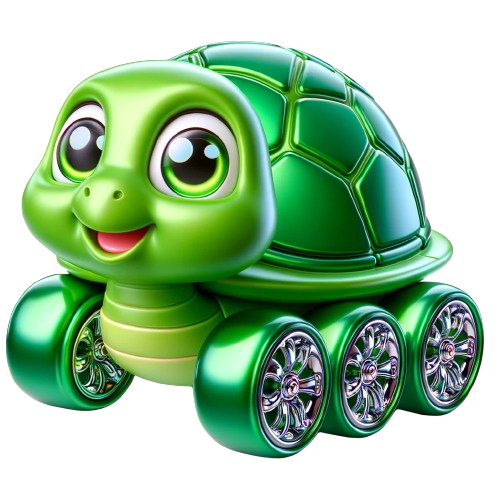 |
| Red Shelli | Deducts 75 points the player in front of you | 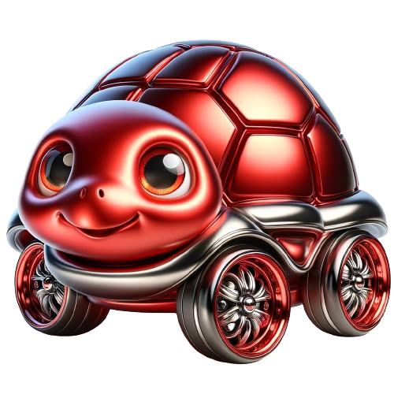 |
| Flash | Mutes audio for 2 seconds | 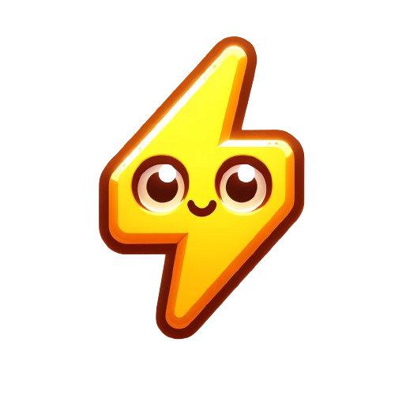 |
| Ghost | Makes lyrics invisible for 5 seconds | 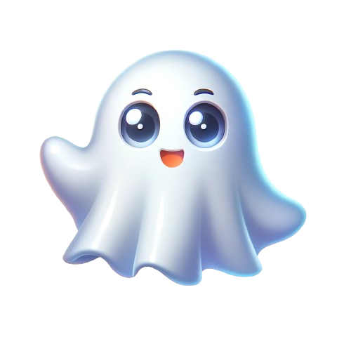 |
| Mushi Mushroom | Gives you 250 points | 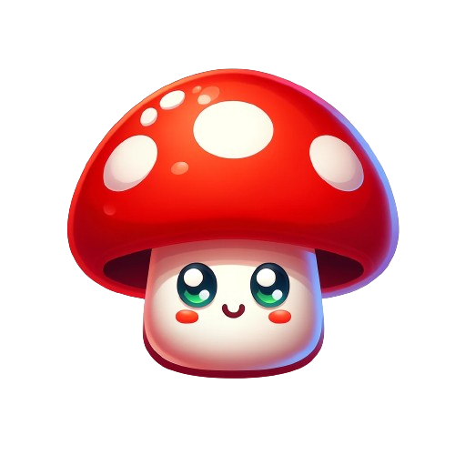 |
| Rocki Rocket | Gives you 500 points |  |
| Star | Speeds up the song for 3 seconds | 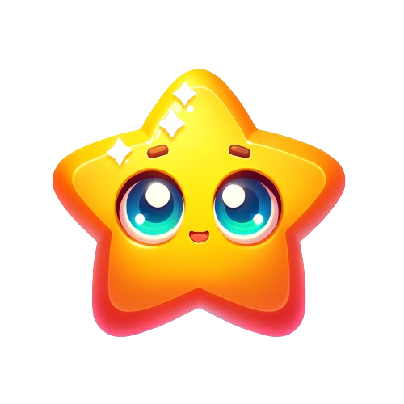 |
| Snail | Slows down the song for 3 seconds | 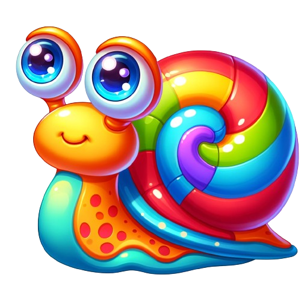 |
| Note Eraser | Hides the notes of all players with more points then the colletor for 5 seconds | 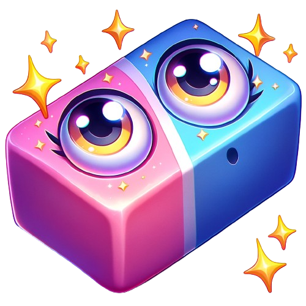 |
| Tina Turne | Rotates the Screen 360° | 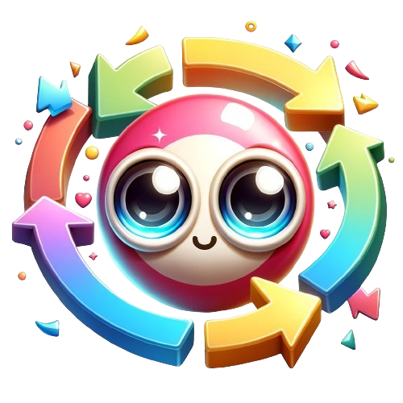 |
| Shaker | Shakes the Screen | 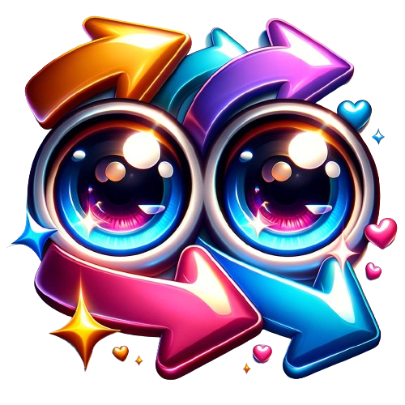 |

## Videos
https://github.com/DerDorius/ItemRumbleMelodyManiaMod/assets/77979816/2639ed17-65d8-4c08-a717-0ce1d9b593fd

https://github.com/DerDorius/ItemRumbleMelodyManiaMod/assets/77979816/3035bf2b-fbd8-4599-9e96-ca0c2b795e33

## Screenshots


Contributions are welcome, especially for animations, as I am not proficient in that area.

## Planned Features

The items could be similar to those in the popular game Mario Kart:

- **Rocket (Bullet Bill)**: Automatically hits all notes for a short period of time.
- **Golden Mushroom**: Grants a points multiplier for a short period of time.
- **Blooper**: Covers the screen with ink, making it difficult to see the lyrics and notes. This benefits players who know the song by heart.


This mode will add a fun and competitive element to MelodyMania, making it more enjoyable for players who want a more dynamic experience.


# Installation
1. Download the latest release `ItemRumbleMelodyManiaMod.zip (zip)` of the Skip Seconds Melody Mania Mod mod from the Releases page.
2. Extract the downloaded ZIP file to a location of your choice.
3. Mod folders are searched in a specific folder called the mods root folder.
4. The mods root folder can be found by executing the command `mod.path` in the game's console (open via `F7`).
5. To install a mod folder, copy it to the mods root folder
6. An app restart may be required afterwards.
7. Activate the Mod in the Game settings
## Usage
1. Launch Melody Mania.
2. Activate Mod
3. Activate Modifier Item Rumble in Modifier Settings (Top Right in Song Select Scene)
4. Start a song in the singing scene.
5. Collect Items by hiting the center of the note

# Documentation

## ItemActions Class

The `ItemActions` class is responsible for handling the actions related to game items. It is injected with various dependencies such as `GameObject`, `PlayerControl`, and `VisualElement` for the player's score label.

### Key Methods

- `AddScore(int points)`: This method is used to add points to the player's score. If the points are negative and the absolute value is greater than the player's total score, the method will return without making any changes. Otherwise, it adds the points to the player's total score and updates the UI.

- `BouncePlayerScoreLabel(float scale)`: This method is used to create a bounce animation on the player's score label. The scale parameter determines the size of the bounce.

- `AnimateItemCollection(ItemControl itemControl)`: This method is used to animate the collection of an item. It removes the item from the hierarchy and logs the name of the GameObject and the item.

- *More Actions and Animations can be implemented here*


## Items.cs Class

The `Items.cs` class is responsible for defining the items that can be collected in the game. Each item is an instance of the `Item` class, which has properties for the item's name, image path, visual element name, and a custom action that is executed when the item is collected.

### Adding New Items

To add a new item to the game, follow these steps:

1. Define a new `Item` instance in the `Items.cs` class. The `Item` constructor takes four parameters:
   - `name`: A string that defines the name of the item.
   - `imagePath`: A string that defines the path to the image that represents the item.
   - `visualElementName`: A string that defines the name of the visual element associated with the item.
   - `customAction`: An action that is executed when the item is collected. This action takes two parameters: an `itemActionsObject` and an `itemControlObject`. These should be cast to the `ItemActions` and `ItemControl` types, respectively, and used to define the behavior of the item when it is collected.

```csharp
public static readonly Item NewItem = new Item("NewItem", "images/items/newItem/newItem.png", "itemCollectorItem", (object itemActionsObject, object itemControlObject) =>
{
    // Cast the object to the correct type.
    var itemActions = (ItemActions)itemActionsObject;
    var itemControl = (ItemControl)itemControlObject;
    // Add Actions here.
    itemActions.AddScore(100);
    itemActions.BouncePlayerScoreLabel();
    itemActions.AnimateItemCollection(itemControl);
});
```

2. Add the new item to the AllItems list:
```csharp
public static readonly List<Item> AllItems = new List<Item>()
{
    Coin,
    Banana,
    NewItem
};
```
3. Ensure that the image for the new item is placed in the specified imagePath and that the visualElementName corresponds to a valid visual element in the game.

4. Implement the desired behavior for the item in the customAction delegate. This could involve adding or subtracting from the player's score, triggering animations, or any other game effects.
5. If `itemActions` does not have the desired Effect implement it in `ItemActions.cs`
6. Generate spawn Probabilities using the Excel sheet. (Scroll down to see generated C# Code)

### Balancing
In this mod for Melody Mania, I've introduced an innovative feature known as "rubberbanding" to enhance the gameplay experience, particularly for players of different skill levels.

Rubberbanding is a dynamic game mechanic that adjusts the difficulty based on the player's performance. It aims to level the playing field and ensure everyone can enjoy the game, whether you're a seasoned singer or a beginner.

The spawn chance of items in Melody Mania depends on your current score distance to the player in the first place. 

To change balancing, edit the Excel file and copy the Generated Code to Items.cs

# Acknowledgements

This project is based on the Coin Collect mod by [Andreas Achimmihca](https://github.com/achimmihca). 
